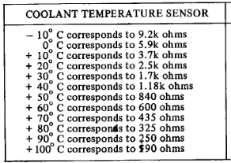

# coolant-controller
Controller for modified Jaguar XJS cooling system.

General:
- Interior, mounted near existing fuse box behind glove compartment
  - -40 to 70C
  - Not water resistant
- 12V system
  - ISO 16750-2
  - ISO 7637-2
  - Withstand +/- 150 V power input
  - Operate at >= 6 V
  - Tolerate short to +/- on any IO
  - Based on text in the service manual, this is better than Jaguar did

Inputs:
- Coolant temperature sensor
  - Choose to keep the fuel injection sensor on the right hand bank because it's the same across a large range of years.
  - Measures 3.74 kOhm at 16.1 C
  - 
- Coolant level sensor
  - Simple reed switch
- Spare ~10kOhm NTC input

Outputs:
- W204 Fan PWM
  - Open collector, 12V tolerant
  - 10.53 Hz, 10% off, 15% min, 90% max
- W204 MAP thermostat
  - ~15.2 Ohm
- Coolant level indicator
  - Small incandescent, low side driver
- Coolant temperature gauge
  - 1 kOhm to 10 Ohm, low side driver
- Fuel injection computer
  - Match input
- Ignition computer
  - Measures 3.42 kOhm at 16.1 C
  - Perhaps the same curve as the fuel one?

Communication:
- CAN
- USB UART